# Super-Resolution Residual Convolutional Generative Adversarial Network


#### Update: Our improved Real-Image SR method titled "Deep Cyclic Generative Adversarial Residual Convolutional Networks for Real Image Super-Resolution (SRResCycGAN)" is appeared in the AIM-2020 ECCV workshop. [[Project Website]](https://github.com/RaoUmer/SRResCycGAN)
An official PyTorch implementation of the [SRResCGAN](https://github.com/RaoUmer/SRResCGAN) model as described in the paper [Deep Generative Adversarial Residual Convolutional Networks for Real-World Super-Resolution](https://arxiv.org/abs/2005.00953). This work is participated in the CVPRW [NTIRE 2020 RWSR](https://data.vision.ee.ethz.ch/cvl/ntire20/) challenges on the Real-World Super-Resolution.

✨ _**Visual examples**_:

[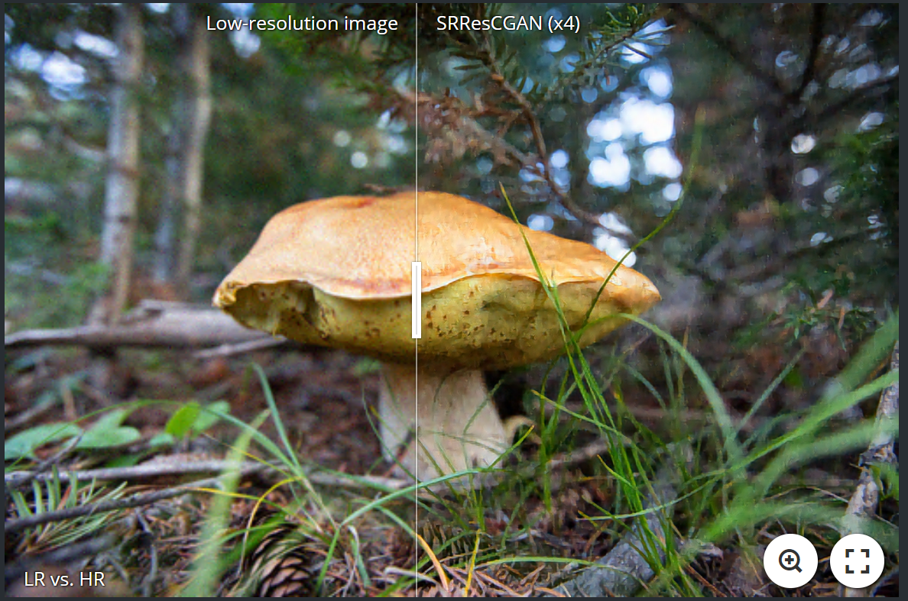](https://imgsli.com/NDg3MDE) [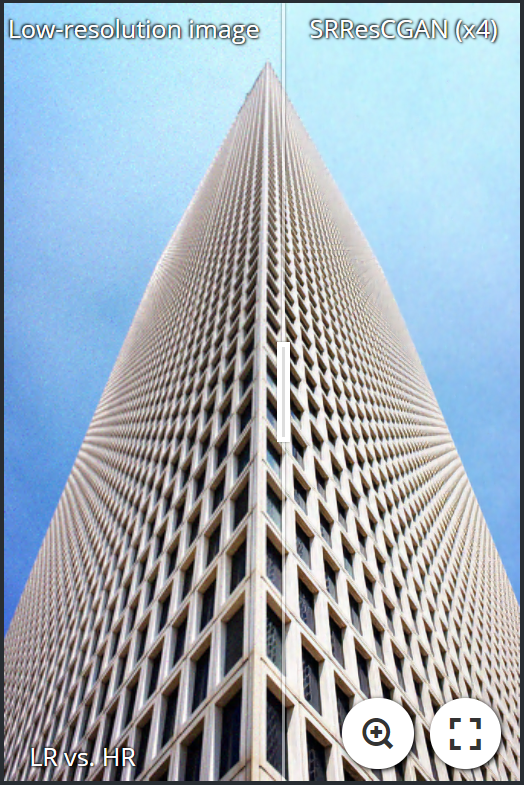](https://imgsli.com/NDg3MDc)

___________

* [Abstract](#abstract)
* [Spotlight Video](#spotlight-video)
* [Paper](#paper)
* [Pre-trained Models](#pre-trained-models)
* [Citation](#bibtex)
* [Quick Test](#quick-test)
* [Train models](#train-models)
* [SRResCGAN Architecture](#srrescgan-architecture)
* [Quantitative Results](#quantitative-results)
* [Visual Results](#visual-results)
* [Code Acknowledgement](#code-acknowledgement)

#### Abstract
> Most current deep learning based single image super-resolution (SISR) methods focus on  designing deeper / wider models to learn the non-linear mapping between low-resolution (LR) inputs and the high-resolution (HR) outputs from a large number of paired (LR/HR) training data. They usually take as assumption that the LR image is a bicubic down-sampled version of the HR image. However, such degradation process is not available in real-world settings i.e. inherent sensor noise, stochastic noise, compression artifacts, possible mismatch between image degradation process and camera device. It reduces significantly the performance of current SISR methods due to real-world image corruptions. To address these problems, we propose a deep Super-Resolution Residual Convolutional Generative Adversarial Network (SRResCGAN) to follow the real-world degradation settings by adversarial training the model with pixel-wise supervision in the HR domain from its generated LR counterpart. The proposed network exploits the residual learning by minimizing the energy-based objective function with powerful image regularization and convex optimization techniques. We demonstrate our proposed approach in quantitative and qualitative experiments that generalize robustly to real input and it is easy to deploy for other down-scaling operators and mobile/embedded devices.

#### Spotlight Video
[](https://youtu.be/auGDoag--fk)

#### Paper
<a href="https://arxiv.org/abs/2005.00953" rel="Paper">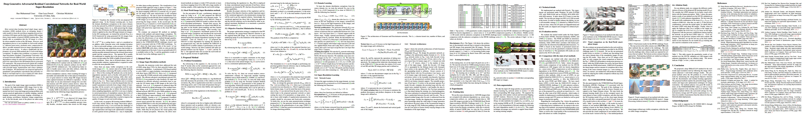</a>

#### Pre-trained Models
| |[DSGAN](https://github.com/ManuelFritsche/real-world-sr/tree/master/dsgan)|[SRResCGAN](https://github.com/RaoUmer/SRResCGAN)|
|---|:---:|:---:|
|NTIRE2020 RWSR|[Source-Domain-Learning](https://drive.google.com/file/d/1HSkk5mGaOk6SnM01Dw_xt8_nrhYNPV4G/view?usp=sharing)|[SR-learning](https://drive.google.com/file/d/1eTKsrZIgQIz7bHjqIbKUBib4AjaGErnt/view?usp=sharing)|

#### BibTeX
    @InProceedings{Umer_2020_CVPR_Workshops,
        author = {Muhammad Umer, Rao and Luca Foresti, Gian and Micheloni, Christian},
        title = {Deep Generative Adversarial Residual Convolutional Networks for Real-World Super-Resolution},
        booktitle = {The IEEE/CVF Conference on Computer Vision and Pattern Recognition (CVPR) Workshops},
        month = {June},
        year = {2020}
        }

## Quick Test

This model can be run on arbitrary images with a Docker image hosted on Replicate: https://beta.replicate.ai/RaoUmer/SRResCGAN. Below are instructions for how to run the model without Docker:

#### Dependencies
- [Python 3.7](https://www.anaconda.com/distribution/) (version >= 3.0)
- [PyTorch >= 1.0](https://pytorch.org/) (CUDA version >= 8.0 if installing with CUDA.)
- Python packages:  `pip install numpy opencv-python`

#### Test models
1. Clone this github repository. 
```
git clone https://github.com/RaoUmer/SRResCGAN
cd SRResCGAN
cd srrescgan_code_demo
```
2. Place your own **low-resolution images** in `./srrescgan_code_demo/LR` folder. (There are two sample images i.e. 0815 and 0829). 
3. Download pretrained models from [Google Drive](https://drive.google.com/drive/folders/1nIOh43GvLrSqM77Uw4PTTntIGy2bEHff?usp=sharing). Place the models in `./srrescgan_code_demo/trained_nets_x4`. We provide two models with source domain learning and SR learning.
4. Run test. We provide SRResCGAN/SRResCGAN+ and you can config in the `test_srrescgan.py (without self-ensemble strategy)` / `test_srrescgan_plus.py (with self-ensemble strategy)`.
```
python test_srrescgan.py      
python test_srrescgan_plus.py  
```
5. The results are in `./srrescgan_code_demo/sr_results_x4` folder.

## Train models
- The SR training code is available in the `training_codes` directory.

## SRResCGAN Architecture
#### Overall Representative diagram
<p align="center">
  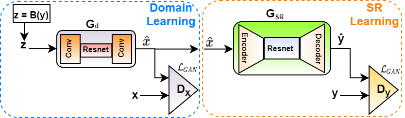
</p>

#### SR Generator Network
<p align="center">
  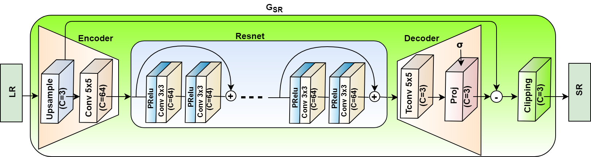
</p>

## Quantitative Results
| <sub>Dataset (HR/LR pairs)</sub> | <sub>SR methods</sub> | <sub>#Params</sub> | <sub>PSNR&#x2191;</sub> | <sub>SSIM&#x2191;</sub> | <sub>LPIPS&#x2193;</sub> | <sub>Artifacts</sub> |
|:---:|:---:|:---:|:---:|:---:|:---:|:---:|
| <sub>Bicubic</sub>| <sub>EDSR</sub>| <sub>43M</sub> |<sub>24.48</sub>|<sub>0.53</sub>|<sub>0.6800</sub>|<sub>Sensor noise (&#x03C3; = 8)</sub>|
| <sub>Bicubic</sub>| <sub>EDSR</sub>| <sub>43M</sub> |<sub>23.75</sub>|<sub>0.62</sub>|<sub>0.5400</sub>|<sub>JPEG compression (quality=30)</sub>|
| <sub>Bicubic</sub>| <sub>ESRGAN</sub>| <sub>16.7M</sub> |<sub>17.39</sub>|<sub>0.19</sub>|<sub>0.9400</sub>|<sub>Sensor noise (&#x03C3; = 8)</sub>|
| <sub>Bicubic</sub>| <sub>ESRGAN</sub>| <sub>16.7M</sub> |<sub>22.43</sub>|<sub>0.58</sub>|<sub>0.5300</sub>|<sub>JPEG compression (quality=30)</sub>|
| <sub>CycleGAN</sub>| <sub>ESRGAN-FT</sub>| <sub>16.7M</sub> |<sub>22.42</sub>|<sub>0.55</sub>|<sub>0.3645</sub>|<sub>Sensor noise (&#x03C3; = 8)</sub>|
| <sub>CycleGAN</sub>| <sub>ESRGAN-FT</sub>| <sub>16.7M</sub> |<sub>22.80</sub>|<sub>0.57</sub>|<sub>0.3729</sub>|<sub>JPEG compression (quality=30)</sub>|
| <sub>DSGAN</sub>| <sub>ESRGAN-FS</sub>| <sub>16.7M</sub> |<sub>22.52</sub>|<sub>0.52</sub>|<sub>0.3300</sub>|<sub>Sensor noise (&#x03C3; = 8)</sub>|
| <sub>DSGAN</sub>| <sub>ESRGAN-FS</sub>| <sub>16.7M</sub> |<sub>20.39</sub>|<sub>0.50</sub>|<sub>0.4200</sub>|<sub>JPEG compression (quality=30)</sub>|
| <sub>DSGAN</sub>| <sub>SRResCGAN (ours)</sub>| <sub>380K</sub> |<sub>25.46</sub>|<sub>0.67</sub>|<sub>0.3604</sub>|<sub>Sensor noise (&#x03C3; = 8)</sub>|
| <sub>DSGAN</sub>| <sub>SRResCGAN (ours)</sub>| <sub>380K</sub> |<sub>23.34</sub>|<sub>0.59</sub>|<sub>0.4431</sub>|<sub>JPEG compression (quality=30)</sub>|
| <sub>DSGAN</sub>| <sub>SRResCGAN+ (ours)</sub>| <sub>380K</sub> |<sub>26.01</sub>|<sub>0.71</sub>|<sub>0.3871</sub>|<sub>Sensor noise (&#x03C3; = 8)</sub>|
| <sub>DSGAN</sub>| <sub>SRResCGAN+ (ours)</sub>| <sub>380K</sub> |<sub>23.69</sub>|<sub>0.62</sub>|<sub>0.4663</sub>|<sub>JPEG compression (quality=30)</sub>|
| <sub>DSGAN</sub>| <sub>SRResCGAN (ours)</sub>| <sub>380K</sub> |<sub>25.05</sub>|<sub>0.67</sub>|<sub>0.3357</sub>|<sub>[unknown (validset)](https://data.vision.ee.ethz.ch/cvl/ntire20/)</sub>|
| <sub>DSGAN</sub>| <sub>SRResCGAN+ (ours)</sub>| <sub>380K</sub> |<sub>25.96</sub>|<sub>0.71</sub>|<sub>0.3401</sub>|<sub>[unknown (validset)](https://data.vision.ee.ethz.ch/cvl/ntire20/)</sub>|
| <sub>DSGAN</sub>| <sub>ESRGAN-FS</sub>| <sub>16.7M</sub> |<sub>20.72</sub>|<sub>0.52</sub>|<sub>0.4000</sub>|<sub>[unknown (testset)](https://data.vision.ee.ethz.ch/cvl/aim19/)</sub>|
| <sub>DSGAN</sub>| <sub>SRResCGAN (ours)</sub>| <sub>380K</sub> |<sub>24.87</sub>|<sub>0.68</sub>|<sub>0.3250</sub>|<sub>[unknown (testset)](https://data.vision.ee.ethz.ch/cvl/ntire20/)</sub>|

#### The NTIRE2020 RWSR Challenge Results ([Track-1](https://data.vision.ee.ethz.ch/cvl/ntire20/))
| <sub>Team</sub> | <sub>PSNR&#x2191;</sub> | <sub>SSIM&#x2191;</sub> | <sub>LPIPS&#x2193;</sub> | <sub>MOS&#x2193;</sub> |
|:---:|:---:|:---:|:---:|:---:|
| <sub>Impressionism</sub>| <sub>24.67 (16)</sub> |<sub>0.683 (13)</sub>|<sub>0.232 (1)</sub>|<sub>2.195</sub>|
| <sub>Samsung-SLSI-MSL</sub>| <sub>25.59 (12)</sub> |<sub>0.727 (9) </sub>|<sub>0.252 (2)</sub>|<sub>2.425</sub>|
| <sub>BOE-IOT-AIBD</sub>| <sub>26.71 (4)</sub> |<sub>0.761 (4)</sub>|<sub>0.280 (4)</sub>|<sub>2.495</sub>|
| <sub>MSMers</sub>| <sub>23.20 (18) </sub> |<sub>0.651 (17)</sub>|<sub>0.272 (3)</sub>|<sub>2.530</sub>|
| <sub>KU-ISPL</sub>| <sub>26.23 (6)</sub> |<sub>0.747 (7)</sub>|<sub>0.327 (8)</sub>|<sub>2.695</sub>|
| <sub>InnoPeak-SR</sub>| <sub>26.54 (5)</sub> |<sub>0.746 (8)</sub>|<sub>0.302 (5)</sub>|<sub>2.740</sub>|
| <sub>ITS425</sub>| <sub>27.08 (2) </sub> |<sub>0.779 (1)</sub>|<sub>0.325 (6)</sub>|<sub>2.770</sub>|
| <sub>**MLP-SR (ours)**</sub>| <sub>24.87 (15)</sub> |<sub>0.681 (14)</sub>|<sub>0.325 (7)</sub>|<sub>2.905</sub>|
| <sub>Webbzhou</sub>| <sub>26.10 (9)</sub> |<sub>0.764 (3)</sub>|<sub>0.341 (9)</sub>|<sub>-</sub>|
| <sub>SR-DL</sub>| <sub>25.67 (11)</sub> |<sub>0.718 (10)</sub>|<sub>0.364 (10)</sub>|<sub>-</sub>|
| <sub>TeamAY</sub>| <sub>27.09 (1)</sub> |<sub>0.773 (2)</sub>|<sub>0.369 (11)</sub>|<sub>-</sub>|
| <sub>BIGFEATURE-CAMERA</sub>| <sub>26.18 (7)</sub> |<sub>0.750 (6)</sub>|<sub>0.372 (12)</sub>|<sub>-</sub>|
| <sub>BMIPL-UNIST-YH-1</sub>| <sub>26.73 (3)</sub> |<sub>0.752 (5)</sub>|<sub>0.379 (13)</sub>|<sub>-</sub>|
| <sub>SVNIT1-A</sub>| <sub>21.22 (19)</sub> |<sub>0.576 (19)</sub>|<sub>0.397 (14)</sub>|<sub>-</sub>|
| <sub>KU-ISPL2</sub>| <sub>25.27 (14) </sub> |<sub>0.680 (15)</sub>|<sub>0.460 (15)</sub>|<sub>-</sub>|
| <sub>SuperT</sub>| <sub>25.79 (10) </sub> |<sub>0.699 (12)</sub>|<sub>0.469 (16)</sub>|<sub>-</sub>|
| <sub>GDUT-wp</sub>| <sub>26.11 (8) </sub> |<sub>0.706 (11)</sub>|<sub>0.496 (17)</sub>|<sub>-</sub>|
| <sub>SVNIT1-B</sub>| <sub>24.21 (17)</sub> |<sub>0.617 (18)</sub>|<sub>0.562 (18) </sub>|<sub>-</sub>|
| <sub>SVNIT2</sub>| <sub>25.39 (13)</sub> |<sub>0.674 (16)</sub>|<sub>0.615 (19)</sub>|<sub>-</sub>|
| <sub>AITA-Noah-A</sub>| <sub>24.65 (-)</sub> |<sub>0.699 (-)</sub>|<sub>0.222 (-)</sub>|<sub>2.245</sub>|
| <sub>AITA-Noah-B</sub>| <sub>25.72 (-)</sub> |<sub>0.737 (-)</sub>|<sub>0.223 (-)</sub>|<sub>2.285</sub>|
| <sub>Bicubic</sub>| <sub>25.48 (-)</sub> |<sub>0.680 (-)</sub>|<sub>0.612 (-)</sub>|<sub>3.050</sub>|
| <sub>ESRGAN Supervised</sub>| <sub>24.74 (-)</sub> |<sub>0.695 (-)</sub>|<sub>0.207 (-)</sub>|<sub>2.300</sub>|

## Visual Results
#### Validation-set ([Track-1](https://data.vision.ee.ethz.ch/cvl/ntire20/))
You can download all the SR resutls of our method on the validation-set from Google Drive: [SRResCGAN](https://drive.google.com/open?id=19RZshg0jfQjKm8AiiZl8vXwMf8Hw9OHJ), [SRResCGAN+](https://drive.google.com/open?id=1fnCmmy1HOlmb0Vkgwieh6dTA94PGQC7K).
<p align="center">
  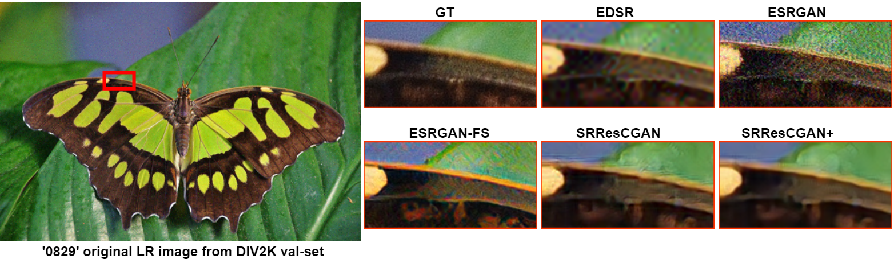
</p>
<p align="center">
  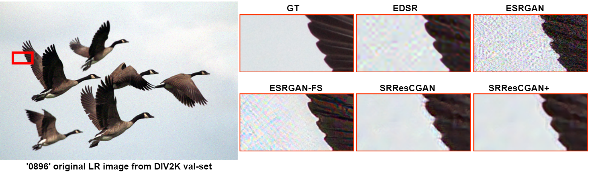
</p>

#### Test-set ([Track-1](https://data.vision.ee.ethz.ch/cvl/ntire20/))
You can download all the SR resutls of our method on the test-set from Google Drive: [SRResCGAN](https://drive.google.com/open?id=1CklEWHvJCXkMJT4oQ9Zlv3q3OpZdlkao), [SRResCGAN+](https://drive.google.com/open?id=1ThJgQjJiUuuvAVreNilH16jiddmg_MrH).
<p align="center">
  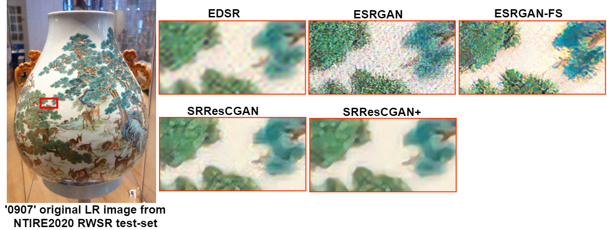
</p>
<p align="center">
  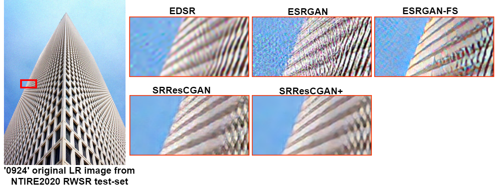
</p>

#### Real-World Smartphone images ([Track-2](https://data.vision.ee.ethz.ch/cvl/ntire20/))
You can download all the SR resutls of our method on the smartphone images from Google Drive: [SRResCGAN](https://drive.google.com/open?id=1z9SG8A13pi7zOmAX70pEdRDCouY6SMH7), [SRResCGAN+](https://drive.google.com/open?id=15tt3qNAHs9_iJzyXcCFnQnqaD7RQZNDW).
<p align="center">
  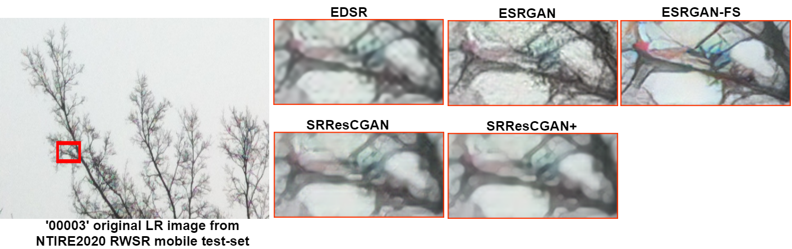
</p>
<p align="center">
  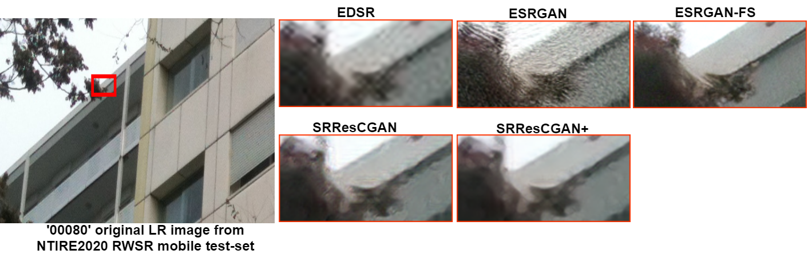
</p>

## Code Acknowledgement
The training and testing codes are somewhat based on [ESRGAN](https://github.com/xinntao/ESRGAN), [DSGAN](https://github.com/ManuelFritsche/real-world-sr), and [deep_demosaick](https://github.com/cig-skoltech/deep_demosaick).
